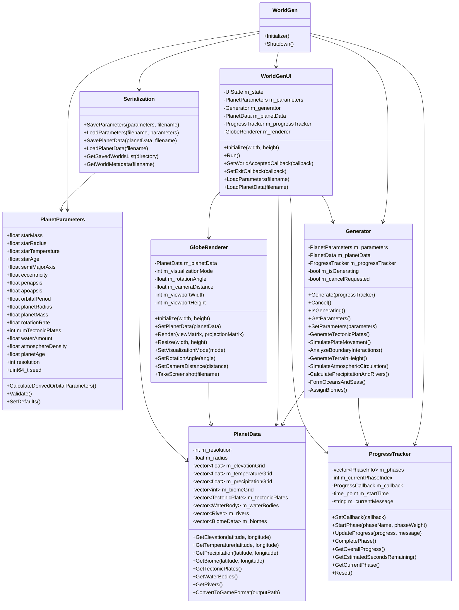

```mermaid
classDiagram
    class WorldGen {
        +Initialize()
        +Shutdown()
    }
    
    class PlanetParameters {
        +float starMass
        +float starRadius
        +float starTemperature
        +float starAge
        +float semiMajorAxis
        +float eccentricity
        +float periapsis
        +float apoapsis
        +float orbitalPeriod
        +float planetRadius
        +float planetMass
        +float rotationRate
        +int numTectonicPlates
        +float waterAmount
        +float atmosphereDensity
        +float planetAge
        +int resolution
        +uint64_t seed
        +CalculateDerivedOrbitalParameters()
        +Validate()
        +SetDefaults()
    }
    
    class Generator {
        -PlanetParameters m_parameters
        -PlanetData m_planetData
        -ProgressTracker m_progressTracker
        -bool m_isGenerating
        -bool m_cancelRequested
        +Generate(progressTracker)
        +Cancel()
        +IsGenerating()
        +GetParameters()
        +SetParameters(parameters)
        -GenerateTectonicPlates()
        -SimulatePlateMovement()
        -AnalyzeBoundaryInteractions()
        -GenerateTerrainHeight()
        -SimulateAtmosphericCirculation()
        -CalculatePrecipitationAndRivers()
        -FormOceansAndSeas()
        -AssignBiomes()
    }
    
    class PlanetData {
        -int m_resolution
        -float m_radius
        -vector~float~ m_elevationGrid
        -vector~float~ m_temperatureGrid
        -vector~float~ m_precipitationGrid
        -vector~int~ m_biomeGrid
        -vector~TectonicPlate~ m_tectonicPlates
        -vector~WaterBody~ m_waterBodies
        -vector~River~ m_rivers
        -vector~BiomeData~ m_biomes
        +GetElevation(latitude, longitude)
        +GetTemperature(latitude, longitude)
        +GetPrecipitation(latitude, longitude)
        +GetBiome(latitude, longitude)
        +GetTectonicPlates()
        +GetWaterBodies()
        +GetRivers()
        +ConvertToGameFormat(outputPath)
    }
    
    class Serialization {
        +SaveParameters(parameters, filename)
        +LoadParameters(filename, parameters)
        +SavePlanetData(planetData, filename)
        +LoadPlanetData(filename)
        +GetSavedWorldsList(directory)
        +GetWorldMetadata(filename)
    }
    
    class ProgressTracker {
        -vector~PhaseInfo~ m_phases
        -int m_currentPhaseIndex
        -ProgressCallback m_callback
        -time_point m_startTime
        -string m_currentMessage
        +SetCallback(callback)
        +StartPhase(phaseName, phaseWeight)
        +UpdateProgress(progress, message)
        +CompletePhase()
        +GetOverallProgress()
        +GetEstimatedSecondsRemaining()
        +GetCurrentPhase()
        +Reset()
    }
    
    class WorldGenUI {
        -UIState m_state
        -PlanetParameters m_parameters
        -Generator m_generator
        -PlanetData m_planetData
        -ProgressTracker m_progressTracker
        -GlobeRenderer m_renderer
        +Initialize(width, height)
        +Run()
        +SetWorldAcceptedCallback(callback)
        +SetExitCallback(callback)
        +LoadParameters(filename)
        +LoadPlanetData(filename)
    }
    
    class GlobeRenderer {
        -PlanetData m_planetData
        -int m_visualizationMode
        -float m_rotationAngle
        -float m_cameraDistance
        -int m_viewportWidth
        -int m_viewportHeight
        +Initialize(width, height)
        +SetPlanetData(planetData)
        +Render(viewMatrix, projectionMatrix)
        +Resize(width, height)
        +SetVisualizationMode(mode)
        +SetRotationAngle(angle)
        +SetCameraDistance(distance)
        +TakeScreenshot(filename)
    }
    
    WorldGen --> PlanetParameters
    WorldGen --> Generator
    WorldGen --> Serialization
    WorldGen --> ProgressTracker
    WorldGen --> WorldGenUI
    Generator --> PlanetData
    Generator --> ProgressTracker
    WorldGenUI --> Generator
    WorldGenUI --> PlanetData
    WorldGenUI --> ProgressTracker
    WorldGenUI --> GlobeRenderer
    GlobeRenderer --> PlanetData
    Serialization --> PlanetParameters
    Serialization --> PlanetData
```
