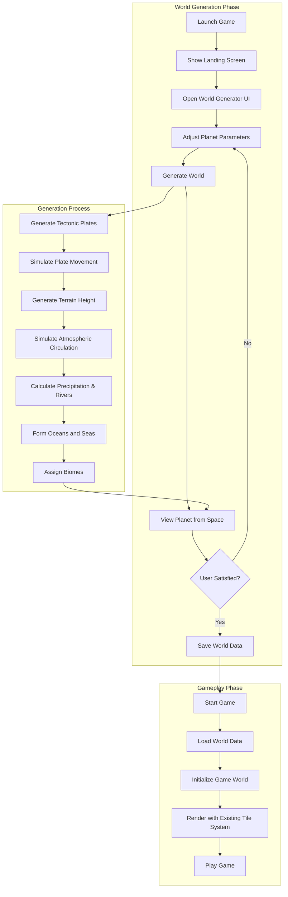

```mermaid
flowchart TD
    subgraph "World Generation Phase"
        A[Launch Game] --> B[Show Landing Screen]
        B --> C[Open World Generator UI]
        C --> D[Adjust Planet Parameters]
        D --> E[Generate World]
        E --> F[View Planet from Space]
        F --> G{User Satisfied?}
        G -->|No| D
        G -->|Yes| H[Save World Data]
    end
    
    subgraph "Gameplay Phase"
        H --> I[Start Game]
        I --> J[Load World Data]
        J --> K[Initialize Game World]
        K --> L[Render with Existing Tile System]
        L --> M[Play Game]
    end
    
    subgraph "Generation Process"
        E --> E1[Generate Tectonic Plates]
        E1 --> E2[Simulate Plate Movement]
        E2 --> E3[Generate Terrain Height]
        E3 --> E4[Simulate Atmospheric Circulation]
        E4 --> E5[Calculate Precipitation & Rivers]
        E5 --> E6[Form Oceans and Seas]
        E6 --> E7[Assign Biomes]
        E7 --> F
    end
```
